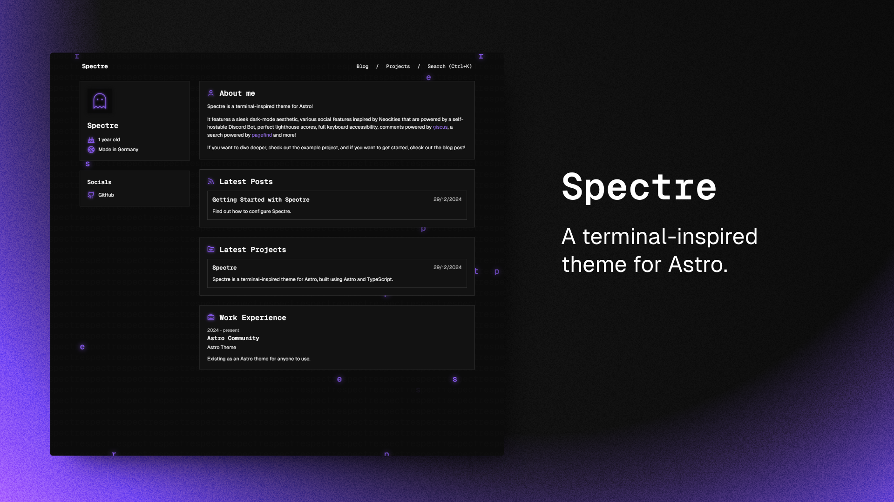

Spectre is a terminal-inspired theme for Astro, built using TypeScript and Astro.

## Getting Started

[](https://stackblitz.com/github/louisescher/spectre/tree/main)
[](https://codesandbox.io/p/sandbox/github/louisescher/spectre/tree/main)

Alternatively, you can create a new Astro project with Spectre like this:

```bash
# npm
npm create astro@latest -- --template louisescher/spectre

# pnpm
pnpm create astro@latest --template louisescher/spectre

# yarn
yarn create astro --template louisescher/spectre
```

## Features

- 100 / 100 Lighthouse performance
- Responsive for all screen sizes
- Fully accessible
- Type-Safe
- Auto-generated sitemap
- Markdown / MDX Support
- Builds on content collections
- Search powered by [pagefind](https://pagefind.app)
- Comments powered by [giscus](https://giscus.app) (can be turned off)
- More!

## Curious?

Head over to [the preview page](https://spectre.louisescher.dev) to find out more!

### Spectre Integration

If you want to know more about how the custom integration that is used in the `astro.config.ts` file works, head over to the [integration's own README](https://github.com/louisescher/spectre/tree/master/package)!